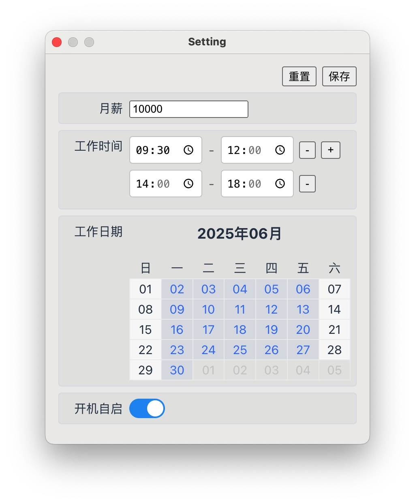

  

 

# nmsz(牛马时钟)

牛马时钟，属于打工人的时钟。

解压双击打开后，点击状态栏出现的图标，点击设置，进入设置页面。

在设置页面中，你可以设置月薪，每天的工作时间，每月的工作日期（默认每月周一到周五），是否开机自启。

设置完成后，牛马时钟会根据这些数值计算上班时间里，每分钟的薪资，并更新在状态栏中。

如果你不想别人看到你的薪资详情，你也可以通过下拉菜单中的显示隐藏进行切换显示状态，当然为了防止别人的突袭，我贴心的准备了Control+T的快捷键进行切换。

## 支持平台

- mac (arm/x64) ✅
- windows ❌ (暂未实现)

### 效果展示

